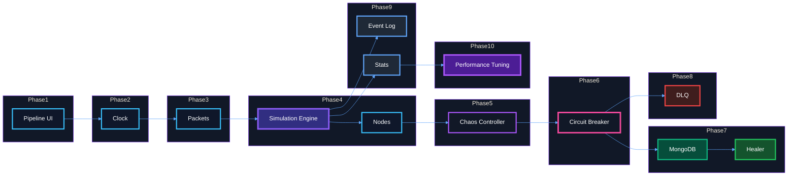

# Arkviz — Phased Implementation

A browser-based distributed systems simulator built incrementally.

---

## Phase 1 — Project Skeleton

- Scaffold Vite + React + TypeScript
- Define core data models (`Packet`, `Node`, `NodeState`, `InsertResult`)
- Build the static pipeline layout
- Render Nodes and SVG connections

---

## Phase 2 — Clock

- Implement the simulation Clock
- Add play/pause and speed controls
- Drive the simulation through ticks
- Display simulation time

---

## Phase 3 — Packets

- Generate packets from the Client
- Animate packet movement through the pipeline
- Track packet route history
- Visualize packet lifecycle

---

## Phase 4 — Simulation Core

- Build the Simulation Engine
- Implement Node behaviors
- Add packet queues and routing
- Integrate Engine with React snapshots

---

## Phase 5 — Failure Injection

- Build the Chaos Controller
- Inject PostgreSQL and Worker failures
- Simulate latency and crashes
- Add countdown-based failure injection

---

## Phase 6 — Circuit Breaker

- Implement the Circuit Breaker state machine
- Track consecutive failures
- Support Closed → Open → Half-Open transitions
- Visualize breaker state

---

## Phase 7 — MongoDB & Healer

- Implement MongoDB fallback storage
- Build the Healer replay loop
- Replay pending packets after recovery
- Visualize replay progress

---

## Phase 8 — Dead Letter Queue

- Add the DLQ
- Route poison packets
- Isolate invalid data
- Track DLQ metrics

---

## Phase 9 — Observability & UX

- Build the Event Log
- Add Stats Panel and KPIs
- Implement packet tracking and tooltips
- Polish animations and visual feedback

---

## Phase 10 — Performance

- Profile rendering and simulation
- Reduce unnecessary React re-renders
- Optimize packet animations
- Add FPS and debugging tools

--- 

